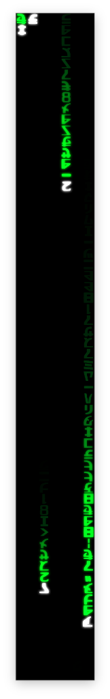

# Matrix Rain VFX

A high-performance, native Matrix digital rain VFX built with Swift and Metal for Mac.



## Features

*   **Native Metal Rendering**: High-performance rendering using a custom Metal pipeline.
*   **Procedural Glyphs**: Generates "Matrix-like" glyphs programmatically (no external assets required).
*   **Bloom Effect**: Post-processing bloom for that authentic glowing look.
*   **Retina Support**: Crisp rendering on high-density displays.
*   **Floating Window**: Runs as a borderless, floating window that stays on top of your desktop wallpaper but below other windows.

## Building without Xcode

You can build and run this application entirely from the terminal using the Swift Package Manager, without needing the full Xcode IDE installed (though you do need the Command Line Tools).

### Prerequisites

*   macOS with Apple Silicon (M1/M2/M3/M4/M5) or Intel.
*   **Xcode Command Line Tools**: Install by running `xcode-select --install` in your terminal.

### Build & Run

1.  **Clone the repository:**
    ```bash
    git clone https://github.com/dparksports/matrix-rain.git
    cd matrix-rain
    ```

2.  **Build the application (Release mode):**
    ```bash
    swift build -c release
    ```

3.  **Run the application:**
    ```bash
    .build/release/MatrixApp
    ```

### Development (Debug mode)

For faster builds during development:

```bash
swift run
```

## Controls

*   **Quit**: Press `Cmd + Q` or kill the process from the terminal (`Ctrl + C`).
